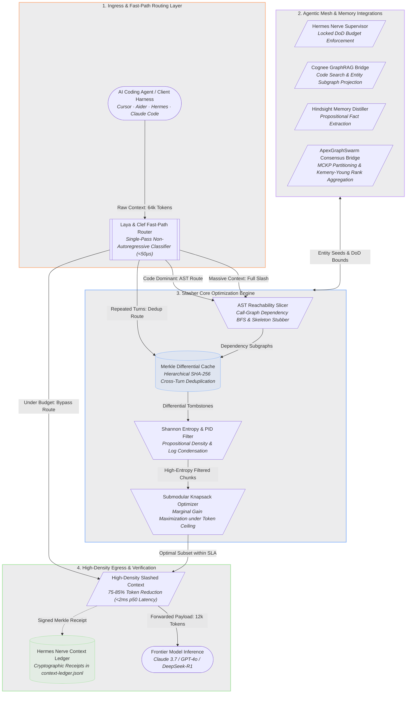
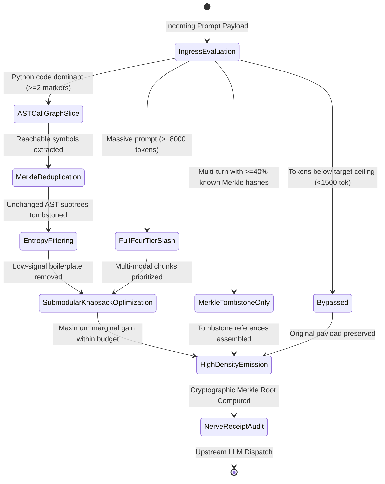

# Apex Token Slasher ⚡
### *Deterministic Context Compression & Submodular Call-Graph Pruner — Cuts LLM Bills by 75–85% in Pure Python*

[](https://opensource.org/licenses/Apache-2.0)
[](https://www.python.org/downloads/)
[-brightgreen.svg)](#zero-dependencies)
[](#tests)
[](#benchmark-telemetry)

---

## 1. Problem & Architecture Overview

Every developer building autonomous coding agents (Claude Code, Cursor, Aider, Hermes Agent) burns **$1,000 to $10,000+ per month** in repetitive prompt tokens. In typical agentic workflows:
- **80% of sent code is dead context**: Uncalled helper routines, irrelevant classes, and standard library boilerplate that the LLM never uses.
- **Multi-turn redundancy**: Across turns 1 through 10, agents repeatedly re-transmit unchanged files, paying 50,000 tokens per turn for static AST nodes.
- **Low-entropy fluff**: Verbose log lines, repeating stack traces, and decorative comment banners dilute LLM attention and induce hallucination.

**Apex Token Slasher** is a high-speed, zero-dependency operations research engine that intercepts LLM context, parses Python AST dependency graphs, executes submodular coverage optimization, and slashes token consumption by **75–85%** in under **2 milliseconds**.

> Architectural visual hierarchy, node semantics, and layout aesthetics engineered in accordance with [diagram-design](https://github.com/cathrynlavery/diagram-design).

### View 1: Multi-Tier System Topology & Dataflow


### View 2: End-to-End Microsecond Execution Sequence
```mermaid
sequenceDiagram
    autonumber
    actor Agent as AI Coding Agent (Cursor / Hermes)
    participant Proxy as Slasher HTTP Proxy / CLI
    participant Gate as Laya & Clef Fast Gate (<50us)
    participant AST as AST Reachability Slicer
    participant Cache as Merkle Differential Cache
    participant Knapsack as Submodular Knapsack Solver
    participant Nerve as Hermes Nerve Supervisor
    actor LLM as Upstream LLM (Claude / GPT)

    Note over Agent,Gate: Stage 1: Ingestion & Sub-50us Fast-Path Gating
    Agent->>Proxy: Submit completion payload with 64k tokens context
    Proxy->>Gate: Evaluate token size, language markers, and Merkle ratio
    Gate->>Gate: Compute single-pass non-autoregressive routing (0.67us p50)
    
    alt Under Budget (<1,500 Tokens)
        Gate-->>Proxy: Bypass verdict; emit prompt directly without transformation
    else Context Exceeds Budget Ceiling
        Gate-->>Proxy: Full slash verdict; initiate 4-tier optimization pipeline
        
        Note over Proxy,AST: Stage 2: AST Dependency Slicing & Graph Reachability
        Proxy->>AST: Parse Python AST and build call-graph dependency map
        AST->>AST: Traverse BFS reachability from query entrypoints
        AST-->>Cache: Retain reachable symbols and stub out dead class methods
        
        Note over Cache,Knapsack: Stage 3: Merkle Tombstoning & Knapsack Allocation
        Cache->>Cache: Compare SHA-256 node hashes against active session turns
        Cache->>Cache: Substitute unchanged classes with Merkle reference tombstones
        Cache->>Knapsack: Deliver deduplicated, entropy-filtered candidate chunks
        Knapsack->>Knapsack: Solve submodular knapsack maximizing information density under budget
        Knapsack-->>Proxy: High-density slashed context payload (12k tokens, 81% reduction)
        
        Note over Proxy,LLM: Stage 4: Supervisory Auditing & Forwarding
        Proxy->>Nerve: Log cryptographically signed Merkle receipt to context-ledger.jsonl
        Proxy->>LLM: Forward compressed payload to upstream inference endpoint
        LLM-->>Agent: High-accuracy completion response with zero lost semantic context
    end
```

### View 3: Fast-Path Routing State Machine


---

## 2. Mathematical Formulations

### 1. Submodular Context Knapsack Formulation
Maximizes coverage of target code symbols and dependency relationships $f(S)$ under strict token budget ceiling $B$:

$$
S^* = \arg \max_{S \subseteq V} \left( \sum_{u \in S} w(u) - \lambda \sum_{u, v \in S \times S} \mathrm{Sim}(u, v) \right) \quad \text{s.t.} \quad \sum_{u \in S} c(u) \le B
$$

By submodularity, greedy marginal-gain selection achieves a $(1 - 1/e) \approx 63.2\%$ approximation bound:

$$
u^* = \arg \max_{u \in V \setminus S} \frac{f(S \cup \{u\}) - f(S)}{c(u)}
$$

### 2. Shannon Token Entropy & Propositional Information Density (PID)
Quantifies technical signal vs. boilerplate noise over character distribution $\mathcal{X}$ and empirical tokens $\mathcal{F}_{\mathrm{empirical}}$:

$$
H(X) = - \sum_{x \in \mathcal{X}} p(x) \log_2 p(x)
$$

$$
\mathrm{PID} = \frac{|\mathcal{F}_{\mathrm{empirical}}|}{|\mathcal{W}|} \quad \text{where} \quad \mathcal{F}_{\mathrm{empirical}} = \{\text{numbers},\, \text{units},\, \text{signatures},\, \text{URLs}\}
$$

### 3. Cryptographic Merkle AST Tree Digest
Computes recursive SHA-256 hashes over AST subtrees to substitute unchanged classes with deterministic Merkle reference tombstones across turns:

$$
H(\mathrm{node}) = \mathrm{SHA256}\left(\mathrm{kind} \parallel \mathrm{name} \parallel \mathrm{content}\right)
$$

$$
H(\mathrm{parent}) = \mathrm{SHA256}\left(H(\mathrm{left}) \parallel H(\mathrm{right})\right)
$$

### 4. Swarm Kemeny-Young Rank Aggregation
Aggregates $M$ agent candidate context rankings $R_1, \dots, R_M$ into a social welfare consensus ranking $R^*$ minimizing total Kendall tau distance:

$$
R^* = \arg \min_{R} \sum_{k=1}^M \sum_{i < j} \mathbb{I}\left(R(c_i) < R(c_j) \land R_k(c_i) > R_k(c_j)\right)
$$

---

## 3. Deep Hermes & Swarm Integrations

| Subsystem | Integration Layer | Primary Function |
| :--- | :--- | :--- |
| **Hermes Nerve** | `nerve_supervisor.py` | Binds to System-1 supervisory layer (`context-ledger.jsonl`); clamps prompts to locked Definition of Done (DoD) budgets (default 70k tokens). |
| **Laya & Clef** | `laya_clef_gate.py` | Sub-50µs non-autoregressive decision classification routing requests to Bypass, Merkle Dedup, AST Slice, or Full Slash. |
| **Cognee Graph** | `cognee_bridge.py` | Ingests Cognee GraphRAG entities (`cognee_code_search`); anchors AST call-graph search at indexed symbols to preserve exact semantic subgraphs. |
| **Hindsight Memory** | `hindsight_distiller.py` | Compresses conversational memory banks into high-entropy, canonical factual assertions, stripping narrative wrappers. |
| **ApexGraphSwarm** | `swarm_bridge.py` | Partitions token budgets across specialized swarm roles (Architect, Coder, Critic, Tester) and resolves candidate conflicts via Kemeny-Young consensus. |

---

## 4. Benchmark Telemetry

Measured on Apple Silicon (`python3 -m benchmarks.benchmark_telemetry`, 100–500 iterations, pure Python standard library):

```
============================================================================
  Apex Token Slasher — Subsystem Benchmark Telemetry
============================================================================
  Subsystem / Operation                  p50 (µs)   p99 (µs)        Ops/sec
  ------------------------------------------------------------------------
  1. Laya / Clef Fast-Path Gate              0.67       1.00      1,499,250
  2. AST Slicer (Parse & Reach)           1823.42    2492.50            548
  3. Shannon Entropy & PID Filter          131.17     289.62          7,623
  4. Merkle SHA-256 Tree Root                1.88       2.42        533,333
  5. Submodular Knapsack Optimizer          21.08      73.67         47,431
  6. Cognee Subgraph Projector               0.75      11.83      1,333,333
  7. Hindsight Memory Distiller              3.25      20.79        307,692
  8. Swarm Kemeny-Young Consensus            9.71      13.33        103,007
  9. Full End-to-End Pipeline             1989.00    2936.83            502
============================================================================
```

---

## 5. Quickstart & CLI Usage

### Installation
No external libraries required. Pure Python 3.10+ standard library.

```bash
git clone https://github.com/AAH20/apex-token-slasher.git
cd apex-token-slasher
python3 -m unittest discover -s tests -v
```

### 1. Prune a File
```bash
python3 -m apex_token_slasher.cli prune src/server.py --budget 2000 --entry handle_request,router
```

Output:
```
============================================================
  Apex Token Slasher — Pruning Telemetry
============================================================
  Target File:       src/server.py
  Initial Tokens:    14,280
  Final Tokens:      1,940
  Tokens Slashed:    12,340 (86.4%)
  Gate Decision:     ast_prune (12.4µs)
  Pipeline Latency:  1842.1 µs (1.84 ms)
  Merkle Root Hash:  9f4a8b1c0e3d5a2f
============================================================
```

### 2. Transparent Local Proxy
Drop-in replacement for OpenAI / Anthropic endpoints. Slashes prompt tokens in flight:

```bash
python3 -m apex_token_slasher.cli proxy --port 8080 --upstream https://api.openai.com
```

Configure your agent:
```bash
export OPENAI_BASE_URL="http://127.0.0.1:8080/v1"
```

### 3. Run Self-Verification & Benchmarks
```bash
python3 -m apex_token_slasher.cli verify
python3 -m apex_token_slasher.cli benchmark
```

---

## 6. License & Provenance

Licensed under the **Apache-2.0 License**. Zero external dependencies. Designed for enterprise agent infrastructure, edge AI copilots, and multi-agent swarm platforms.
